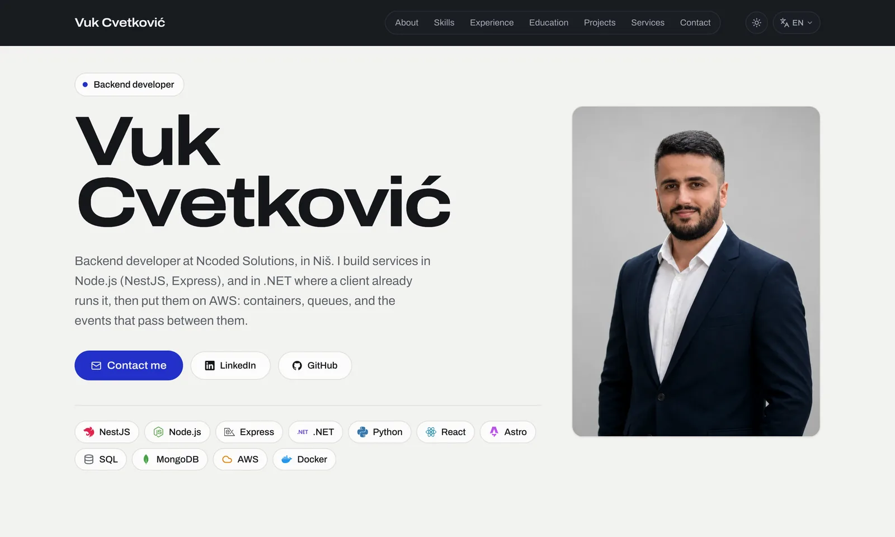

# vukcvetkovic.com

The source of my personal site: **[vukcvetkovic.com](https://vukcvetkovic.com)**

<!-- Both shots are the live home page at 1440x900, taken in Chrome and saved as webp.
     GitHub picks one by the reader's theme, which is the site's own trick. -->
<a href="https://vukcvetkovic.com">
  <picture>
    <source media="(prefers-color-scheme: dark)" srcset="./.github/hero-dark.webp" />
    
  </picture>
</a>

I am Vuk Cvetković, a backend developer at Ncoded Solutions in Niš, Serbia. I build
services in Node.js (NestJS, Express) and the event-driven infrastructure they run on in
AWS, and carry the same work through to the React interfaces on top when a project needs
it. The site itself has the longer version, in English, Serbian, French and German.

[LinkedIn](https://www.linkedin.com/in/vuk3/) · [GitHub](https://github.com/Vuk3)

## What it is

Twenty-eight prerendered pages across four locales, on Cloudflare. Nothing runs at request
time: `dist/server` builds empty and every route is static HTML.

A few things about it are worth a look if you are here to read code rather than the CV:

- **It ships no JavaScript file.** The build emits zero `.js`, and the whole page weighs
  about 26 KB gzipped with the stylesheet inlined into it. What behaviour there is comes
  from four small inline blocks: the pre-paint theme script, the theme toggle, one
  dismissal listener for every disclosure on the page, and the active-section indicator.
- **The motion is CSS.** Section reveals and the request diagram are driven by `view()`
  and `scroll(root)` timelines rather than an observer or a library, and every animation
  sits behind `prefers-reduced-motion` so a reader who asked for less gets the finished
  page rather than a hidden one.
- **Translations are a compile-time contract.** `Dict` is derived from the English
  dictionary, so a key that is missing, misspelled or the wrong shape in one of the other
  three fails `astro check` and therefore fails the build.
- **Content ids are round-tripped through that contract.** A project, role or skill group
  in `src/site.ts` cannot name something that has no copy behind it, and a technology
  cannot be listed without a mark in the registry. Both are type errors, not gaps on the
  page.
- **Facts live once.** Anything identical in all four languages, a name, a URL, an
  employer, a date, is in `src/site.ts`, and the four dictionaries hold only prose. The
  build config reads the locale list from the same file rather than repeating it.
- **Lighthouse is 100 across all four categories on desktop**, with CLS 0 and no blocking
  time.

## Stack

[Astro](https://astro.build) 7, [Tailwind](https://tailwindcss.com) 4, TypeScript, and
`@astrojs/cloudflare` for the output shape. `sharp` handles images at build time and no
image touches the runtime. Node 22.12 or newer.

## Commands

| Command | What it does |
|---|---|
| `npm run dev` | Dev server |
| `npm run check` | `astro check`, the project's only gate |
| `npm run build` | Runs `astro check` first, then builds |
| `npm run preview` | Serves the built output |
| `npm run release -- [patch\|minor\|major]` | Fast-forwards `main` from `develop`, bumps the version, tags and pushes |

## Docs

The reasoning behind most of the numbers is written down, both in the code and in
[docs/](./docs/):

| | |
|---|---|
| [docs/README.md](./docs/README.md) | the map, and where each kind of change lives |
| [docs/design-system.md](./docs/design-system.md) | tokens, the card, the type scale, and every animation |
| [docs/content-and-i18n.md](./docs/content-and-i18n.md) | the fact/prose split, the dictionary contract, adding a locale |
| [docs/routing-and-deploy.md](./docs/routing-and-deploy.md) | the duplicated route tree, `build.format`, 404s, the sitemap |

[AGENTS.md](./AGENTS.md) carries the working rules, and `CLAUDE.md` is a symlink to it so
the two cannot drift.

## Reuse

The code is here to be read. The content, the photograph and the design are mine, so
please do not redeploy this as your own site.
